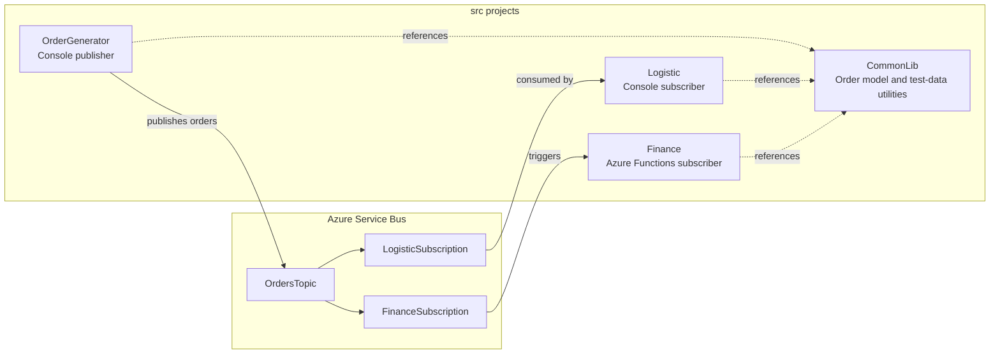

# Source projects

The solution contains one shared library, a console publisher, a console
subscriber, and an Azure Functions subscriber.

## Project structure



| Project | Purpose |
| --- | --- |
| `CommonLib` | Contains the shared `Order` entity and order generator utility. |
| `OrderGenerator` | Creates sample orders and publishes them to `OrdersTopic`. |
| `Logistic` | Receives orders from `LogisticSubscription`. |
| `Finance` | Uses an Azure Functions Service Bus trigger to process `FinanceSubscription`. |

## Configure the demo

Provision the Service Bus resources by following the AZD instructions in the
[root README](../README.md). You can inspect each required deployment output
with `azd env get-value <output-name>`. Connection-string outputs are secrets;
do not commit them or include them in logs.

### Configure OrderGenerator

Set `OrderGenerator/appsettings.local.json` to the following values:

```json
{
  "ServiceBus": {
    "ConnectionString": "<SERVICEBUS_TOPIC_CONNECTION_STRING>",
    "TopicName": "<SERVICEBUS_TOPICNAME>"
  }
}
```

Use these AZD outputs:

- `SERVICEBUS_TOPIC_CONNECTION_STRING` for `ConnectionString`
- `SERVICEBUS_TOPICNAME` for `TopicName`

### Configure Logistic

Set `Logistic/appsettings.local.json` to the following values:

```json
{
  "ServiceBus": {
    "ConnectionString": "<SERVICEBUS_LOGISTIC_SUBSCRIPTION_CONNECTION_STRING>",
    "TopicName": "<SERVICEBUS_TOPICNAME>",
    "SubscriptionName": "<SERVICEBUS_LOGISTICSUBSCRIPTIONNAME>"
  }
}
```

Use these AZD outputs:

- `SERVICEBUS_LOGISTIC_SUBSCRIPTION_CONNECTION_STRING` for `ConnectionString`
- `SERVICEBUS_TOPICNAME` for `TopicName`
- `SERVICEBUS_LOGISTICSUBSCRIPTIONNAME` for `SubscriptionName`

### Configure Finance

Set the `Values` object in `Finance/local.settings.json` as follows:

```json
{
  "IsEncrypted": false,
  "Values": {
    "AzureWebJobsStorage": "UseDevelopmentStorage=true",
    "FUNCTIONS_WORKER_RUNTIME": "dotnet-isolated",
    "ServiceBusConnection": "<SERVICEBUS_FINANCE_SUBSCRIPTION_CONNECTION_STRING>",
    "ServiceBusTopicName": "<SERVICEBUS_TOPICNAME>",
    "ServiceBusSubscriptionName": "<SERVICEBUS_FINANCESUBSCRIPTIONNAME>"
  }
}
```

Use these AZD outputs:

- `SERVICEBUS_FINANCE_SUBSCRIPTION_CONNECTION_STRING` for `ServiceBusConnection`
- `SERVICEBUS_TOPICNAME` for `ServiceBusTopicName`
- `SERVICEBUS_FINANCESUBSCRIPTIONNAME` for `ServiceBusSubscriptionName`

`UseDevelopmentStorage=true` requires a local
[Azurite](https://learn.microsoft.com/azure/storage/common/storage-use-azurite)
instance. Alternatively, set `AzureWebJobsStorage` to a development Storage
account connection string.

## Start the demo

Build the solution first from the repository root:

```sh
dotnet build src/AzureServiceBus.sln
```

Start the consumers before publishing orders. Run each project in a separate
terminal.

### Start Logistic

Start the console subscriber from the repository root:

```sh
dotnet run --project src/Logistic/Logistic.csproj
```

The process listens to `LogisticSubscription`. Press Enter to stop it.

### Start Finance

Install [Azure Functions Core Tools](https://learn.microsoft.com/azure/azure-functions/functions-run-local)
and start Azurite when `AzureWebJobsStorage` uses local development storage.
Then start the function host:

```powershell
Set-Location src/Finance
func start
```

The Service Bus trigger listens to `FinanceSubscription`. Press Ctrl+C to stop
the function host.

### Start OrderGenerator

After both consumers are running, start the publisher from the repository root:

```sh
dotnet run --project src/OrderGenerator/OrderGenerator.csproj
```

Enter the number of orders to generate when prompted. Each order is published
to `OrdersTopic` and delivered to both subscriptions.
